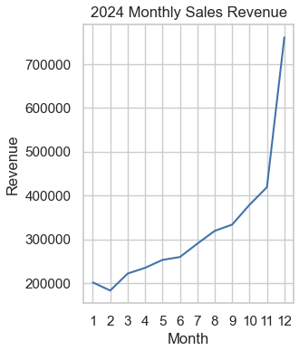
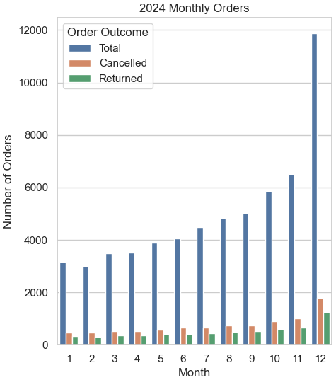
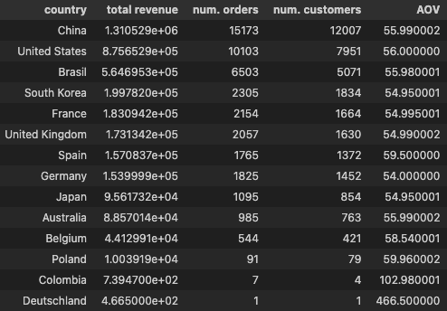

# Ecommerce Data Analysis & CLV Prediction App

> [!WARNING]
> All the metrics, plots, and insights are made up and taken from the internet

# Dataset
The dataset used for this project is the 'theLook eCommerce' dataset which is publicly available on [Google BigQuery](https://console.cloud.google.com/bigquery/analytics-hub/discovery/projects/1057666841514/locations/us/dataExchanges/google_cloud_public_datasets_17e74966199/listings/thelook_ecommerce).

This dataset contains data from a fictitious eCommerce clothing site developed by the Looker team. The dataset consists of various different tables containing information about various topics such as customers, products, orders, inventory etc.

# Objectives

 The main objectives of this project are three-fold:
 > 1. **To analyse company data and uncover critical insights that will improve *theLook*'s commercial success**
 > 2. **To develop an API function that will identify recently acquired customer's with potential for large revenue**
 > 3. **To develop an API function that will recommend products based on the customer's previous purchases**
 

 To achieve these objectives, we broke the problems down into the following mini-objectives:
 1. Analyse the data and uncover critical insights that will improve *theLook*'s commercial success:
   1.1 Analyse *theLook*'s database structure using SQL for familiarization with the dataset's table relationships.
   1.2 Uncover insights and provide recommendations on the following areas: sales trends analysis, product level performance, regional performance, website performance analysis, customer base analysis.
   1.3 Produce both high-level overviews and in-depth reports of the insights uncovered in each of the previously mentioned key areas.

 2. Develop an API function that will predict customer lifetime value and identify recently acquired customer's with potential for large revenue:
   2.1 Import order data from Google BigQuery on a weekly basis and calculate Recency, Frequency, and Monetary Value for all of *theLook*'s customers.
   2.2 Use the [lifetimes](https://lifetimes.readthedocs.io/en/latest/index.html) python package to predict future revenue for *theLook*'s customers that made their first purchase less than 90 days ago.
   2.3 Return a list of customers that made their first purchase less than 90 days ago, who's predicted CLV (customer lifetime value) is very large.

 3. Develop an API that will recommend products based on the customer's previous purchases:
   3.1 Extract product data from Google BigQuery on a weekly basis and create embeddings of the product names.
   3.2 Create a function which extracts a customer's order data from Google BigQuery and creates embeddings of the names of the previously purchased products.
   3.3 Use an LLM to evaluate the similarity between a customers previously purchased products, and all products available at *theLook*, and return a list of the most similar products.

# Objective 1 : Analyse company data and uncover critical insights that will improve *theLook*'s commercial success

## Data Structure & Initial Checks
theLook's database structure consists of seven tables containing information on: users, events, orders, order items, products, inventory items, and distribution centers. These tables are related to each other through various shared keys as can be seen in the image below.

## Sales Insights

Following and initial dip in February, sales revenue increased throughout the rest of the remaining months, reaching 419,107.31 in November and 761,268.46 in December, and producing a total revenue of 3,857,533.35 dollars for 2024. This is an increase of 1,969,808.34 (104.35%) over 2023's total sales revenue which was 1,887,725.01.

The monthly orders followed a similar trend to the sales revenue, dipping initially before increasing with a significant spike in December. In total there were 59,712 orders placed in 2024, however 8,985 (15.05%) of these orders were cancelled, leaving 50,727 fulfilled orders, of which further 6,119 (12.06%) were later returned, meaning that only 44,608 of the overall 59,712 orders placed in 2024 (74.71%) actually generated revenue.
Whilst order cancellations may be very difficult to prevent, ensuring high quality delivery of the initial order could prevent returns which in 2024 would have generated an extra 532,427.79 (13.8% of the revenue in 2024). 
As such a key focus for 2025 should be to minimise return rates by improving product descriptions, ensuring high-quality images of the product are used, and offering size guides, to name a few solutions.

The average order value in 2024 for uncancelled and unreturned order was 55.95. Looking at the AOV's of individual countries we can see that Spain, Poland, and Belgium had AOVs noticeably higher than this, and thus in 2025 we should consider increasing marketing campaigns to these regions. Note that whilst Colombia had an extremely high AOV of 102.98, this value is composed of only 7 orders and thus we should not make any decisions based on this value due to the extremely small sample size.
As one might have expected, China, the U.S., and Brazil were the top three countries for both total revenue, and number of orders placed.

