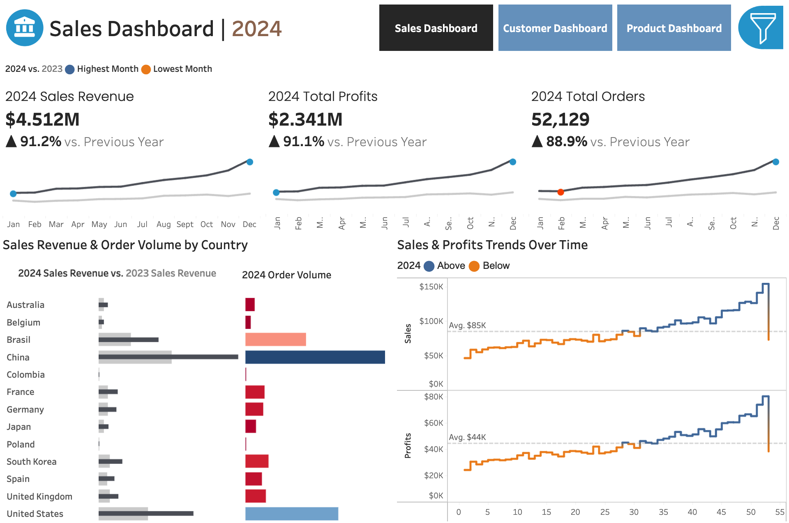

# Ecommerce Data Analysis & CLV Prediction App

> [!WARNING]
> All the metrics, plots, and insights are made up and taken from the internet

# Dataset
The dataset used for this project is the 'theLook eCommerce' dataset which is publicly available on [Google BigQuery](https://console.cloud.google.com/bigquery/analytics-hub/discovery/projects/1057666841514/locations/us/dataExchanges/google_cloud_public_datasets_17e74966199/listings/thelook_ecommerce).

This dataset contains data from a fictitious eCommerce clothing site developed by the Looker team. The dataset consists of various different tables containing information about various topics such as customers, products, orders, inventory etc.

# Project Background

 The main objectives of this project are three-fold:
 > 1. **To analyse company data and uncover critical insights that will improve *theLook*'s commercial success**
 > 2. **To develop an API function that will identify recently acquired customer's with potential for large revenue**
 > 3. **To develop an API function that will recommend products based on the customer's previous purchases**
 

 To achieve these objectives, we broke the problems down into the following mini-objectives:
 1. Analyse the data and uncover critical insights that will improve *theLook*'s commercial success:
   1.1 Analyse *theLook*'s database structure using SQL for familiarization with the dataset's table relationships.
   1.2 Uncover insights and provide recommendations on the following areas: sales trends, regional performance, customer analysis, and product level performance.
   1.3 Produce a high-level report of the insights uncovered, and an interactive Tableau dashboard displaying key metrics and graphs to accompany the report.

 2. Develop an API function that will predict customer lifetime value and identify recently acquired customer's with potential for large revenue:
   2.1 Import order data from Google BigQuery on a weekly basis and calculate Recency, Frequency, and Monetary Value for all of *theLook*'s customers.
   2.2 Use the [lifetimes](https://lifetimes.readthedocs.io/en/latest/index.html) python package to predict future revenue for *theLook*'s customers that made their first purchase less than 90 days ago.
   2.3 Return a list of customers that made their first purchase less than 90 days ago, who's predicted CLV (customer lifetime value) is very large.

 3. Develop an API that will recommend products based on the customer's previous purchases:
   3.1 Extract product data from Google BigQuery on a weekly basis and create embeddings of the product names.
   3.2 Create a function which extracts a customer's order data from Google BigQuery and creates embeddings of the names of the previously purchased products.
   3.3 Use an LLM to evaluate the similarity between a customers previously purchased products, and all products available at *theLook*, and return a list of the most similar products.

An interactive Tableau dashboard presenting key sales and customer metrics can be viewed [here](https://public.tableau.com/app/profile/axel.eichelmann5606/viz/TheLook-eCommerceSalesAnalysis/SalesDashboard).

The SQL queries used to clean, organize and prepare data for the project can be viewed [here](https://github.com/axeleichelmann/ecommerce-project/blob/feature/create-mvp/queries/Data%20Cleaning.sql)

# Data Structure & Initial Checks
theLook's database structure consists of seven tables containing information on: users, events, orders, order items, products, inventory items, and distribution centers. These tables are related to each other through various shared keys as can be seen in the image below.

# Executive Summary
### Overview of findings
Sales metrics across the board have seen impressive growth in 2024, with slight spikes during December which can be attributed to the christmas shopping demand. Compared to 2023, revenue has increased by 94.1%, profits by 93.9%, and order volume by 95%. While the overall company performance has been extremely good, the following sections will explore additional areas for improvement.

### Sales Trends:
* The company has consistent growth in sales and profits throughout 2024 with a fall to just above the yearly average in the final week of the year. This decrease can likely be attributed to the decrease in demand post-christmas period.
* The biggest client markets - China, United States, and Brazil - saw revenue increases of 93%, 93.2%, and 104.2% respectively and were responsible for 71.2% of the company's total revenue with China alone accounting for 34% of this. In 2025 efforts should be aimed at diversifying revenue sources by increasing marketing in medium sized markets such as South Korea, Spain and UK.
* Australia and Poland made 1,191 and 118 orders respectively and brought in $104.8k and $11.1k. We should increase marketing efforts in these regions due to their strong economic status and large populations making them countries with large potential for revenue. This will further help to diversify our regional portfolio.

Below is the sales overview page from the Tableau dashboard. The entire interactive dashboard can be viewed [here](https://public.tableau.com/app/profile/axel.eichelmann5606/viz/TheLook-eCommerceSalesAnalysis/SalesDashboard).

### Customer Analysis:
* In 2024 we received orders from 41,723 customers which was a 95.7% increase on the previous year's 24,376 customers. Of these customers, 10,283 (24.6%) made more than one order.
* $2,078,628 (43.5%) of our revenue in 2024 came from these 24.6% of customers that made more than one order. This highlights the importance of returning customers thus efforts should be made the promote repeat buying perhaps by offering deals to returning customers.
* Seven of the top 10 highest revenue customers in 2023 did not make a purchase in 2024 - four of these were multiple time buyers. Accordingly, protocols should be implemented in order to maintain relationships with high-value customers to prevent their churn.

Below is the customer overview page from the Tableau dashboard. The entire interactive dashboard can be viewed [here](https://public.tableau.com/app/profile/axel.eichelmann5606/viz/TheLook-eCommerceSalesAnalysis/CustomerDashboard).

