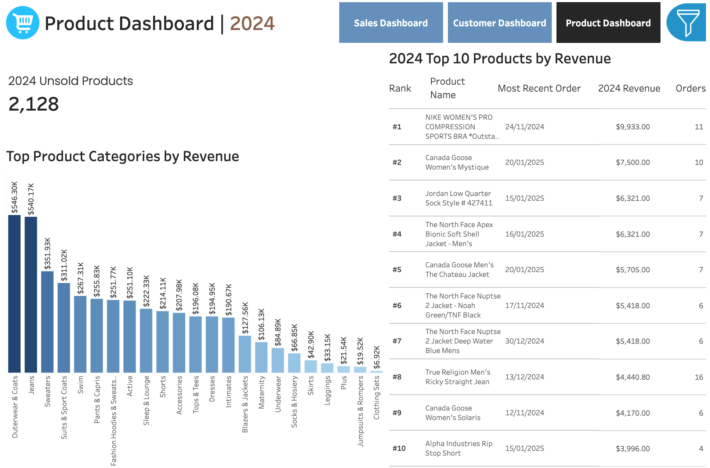

# Ecommerce Data Analysis & CLV Prediction App

> [!WARNING]
> All the metrics, plots, and insights are made up and taken from the internet

# Dataset
The dataset used for this project is the [*The Look eCommerce*]((https://console.cloud.google.com/bigquery/analytics-hub/discovery/projects/1057666841514/locations/us/dataExchanges/google_cloud_public_datasets_17e74966199/listings/thelook_ecommerce)) dataset which is publicly available on Google BigQuery.

This dataset contains data from a fictitious eCommerce clothing site developed by the Looker team. The dataset consists of various different tables containing information about various topics such as customers, products, orders, inventory etc.

# Project Background

 The main objectives of this project are two-fold:
 > 1. **To analyse company data and uncover actionable insights that will improve *The Look*'s commercial success**
 > 2. **To develop a web application that will provide valuable insights into *The Look*'s customer base and facilitate the optimization of marketing campaigns**
 

 To achieve these objectives, we broke the problems down into the following mini-objectives:
 1. Analyse company data and uncover actionable insights that will improve *The Look*'s commercial success

      1.1 Analyse *theLook*'s database structure in Google BigQuery using SQL to get familiar with the dataset's table relationships. Also perform exploratory data analysis in BigQuery to identify any necessary cleaning or pre-processing that needs to be applied to the data before the data analysis phase.

      1.2. Carry out data analysis in Python & Tableau, and produce a Tableau dashboard that highlights key insights from the data analysis.
      
      1.3 Produce a high-level executive summary report discussing the key insights shown in the Tableau dashboard, and provide suggestions on actions to take to improve *The Look*'s commercial success.

 2. Develop a web application that will provide valuable insights into *The Look*'s customer base and facilitate the optimization of marketing campaigns

      2.1 Create a high-value customer prediction model which aims to identify shoppers that made their first purchase within the last 90 days, and whom have the potential for large customer lifetime value. Creating this model will involve experimenting with a rule-based prediction approach, and a machine learning based prediction approach that uses the [*lifetimes*](https://lifetimes.readthedocs.io/en/latest/index.html) python package to predict shoppers' future equity.

      2.2 Create a product recommendation function that recommends products currently in *The Look*'s stock based on the similarity of the product to the shopper's previously purchased products. The similarity between products will be determined by an LLM that calculates the distance between embeddings of product names.

      2.3. Deploy both the high-value customer prediction model and the product recommendation function as an API on Google Cloud Run, which is accessible via a web-app frontend. This frontend will display the list of predicted high-value shoppers returned by the API, and will be able to return product recommendations for a shopper after their shopper ID is provided as a text input.

# Data Structure & Initial Checks
*The Look*'s database structure consists of seven tables containing information on: users, events, orders, order items, products, inventory items, and distribution centers. These tables are related to each other through various shared keys as can be seen in the image below.

The SQL queries used to clean, organize and prepare data for the project can be viewed [here](https://github.com/axeleichelmann/ecommerce-project/tree/main/queries)

# Executive Summary
### Overview of findings
Sales metrics across the board have seen impressive growth in 2024, with slight spikes during December which can be attributed to the christmas shopping demand. Compared to 2023, revenue has increased by 91.2%, profits by 91.1%, and order volume by 88.9%. While the overall company performance has been extremely good, the following sections will explore additional areas for improvement.

### Sales Trends:
* The company has seen consistent growth in sales and profits throughout 2024 with a fall to just below the yearly average in the final week of the year. This decrease can likely be attributed to the decrease in demand post-christmas period.
* The biggest client markets - China, United States, and Brazil - saw revenue increases of 91.5%, 92.2%, and 87.4% respectively and were responsible for 70.7% of the company's total revenue with China alone accounting for 33.6% of this. In 2025 efforts should be aimed at diversifying revenue sources by increasing marketing campaigns in medium sized markets such as South Korea, Spain, UK, France, and Germany.
* Australia and Poland made 1,148 and 117 orders respectively and brought in only $101.1k and $7.9k. We should increase marketing efforts in these regions due to their strong economic status and large populations making them countries with large potential for revenue. This will further help to diversify our regional portfolio.

Below is the sales overview page from the Tableau dashboard. The entire interactive dashboard can be viewed [here](https://public.tableau.com/app/profile/axel.eichelmann5606/viz/TheLook-eCommerceSalesAnalysis/SalesDashboard).

### Customer Analysis:
* In 2024 we received orders from 39,897 customers which was a 89.5% increase on the previous year's 23,713 customers. Of these customers, 6,973 (17.5%) made more than one order.
* $1,864,325 (41.3%) of our revenue in 2024 came from these 17.5% of customers that made more than one order. This highlights the importance of returning customers thus efforts should be made the promote repeat buying perhaps by offering deals to returning customers.
* 6 of the top 10 highest revenue customers in 2023 did not make a purchase in 2024 - 5 of these were multiple time buyers. Accordingly, protocols should be implemented in order to maintain relationships with high-value customers to prevent their churn.

Below is the customer overview page from the Tableau dashboard.

### Product Analysis:
* The top performing category was outerwear & coats bringing in $546.3k of revenue followed closely by Jeans which sold $540.17k, and then Sweaters which sold $351.93k.
* 6 out of the top 10 highest revenue products in 2024 were cold weather jackets. Based on this and the previous insight, we should consider expanding the range of available products within the category of outerwear and coats in order to further increase sales in 2025.
* There were 2,128 products in our inventory that achieved no sales in 2024. We should consider removing these from out inventory through flash sales in order to minimize losses.

Below is the product overview page from the Tableau dashboard.

# Web-Application User Guide
The [web-application frontend](https://web-app-frontend-production-50293729231.europe-west10.run.app/) has the following layout:

At the top of the page is the product recommendation function which provides product recommendations for a shopper based on their previous purchases. In order to generate product recommendations, simply input the Customer ID of the shopper for whom you want recommended products, and click on the 'Find Recommended Products' button. For example, in the image below we see the output when product recommendations are generated for the shopper 'Eric Carpenter' with Customer ID 99484.

Below this function is the list of predicted upcoming high value shoppers. These are shoppers who made their first purchase less than 90 days ago, and are predicted to have a large customer lifetime value. Each entry in this list contains the shoppers Customer ID, Name, Email, and their prediced future equity in the next 12 months.

This application facilitates improved marketing campaigns by not only identifying shoppers with the potential for large revenue, but also providing personalized content for content for marketing campaigns that will be more likely to cause the shopper to make repeat purchases than a generic blanket marketing approach.